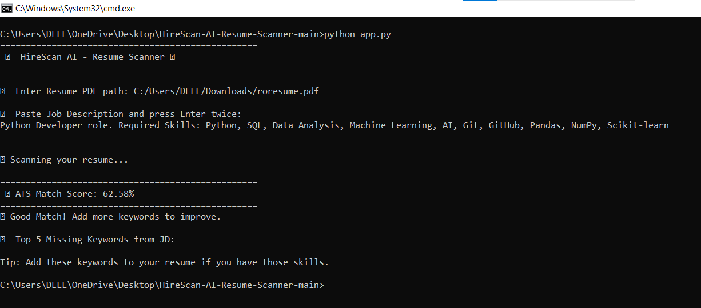

# HireScan AI - ATS Resume Scanner 🤖📄

<p align="center">
  
  
  
</p>

<p align="center">
  An AI-powered tool that scans your resume against a Job Description and gives you an instant ATS Match Score.
</p>

---

## 🌟 About The Project

Recruiters at companies like TCS, Infosys, and Google use ATS - Applicant Tracking Systems to filter 1000s of resumes.

**HireScan AI** simulates that exact process. 
It extracts text from your PDF resume, compares it with a Job Description using keyword matching, and tells you:
1.  **ATS Match Score in %**
2.  **Which keywords are missing**

This project demonstrates my understanding of NLP, Python, and real-world hiring problems.

---

## ✨ Key Features

- ✅ **PDF Text Extraction**: Reads any resume in PDF format
- ✅ **JD Comparison**: Compares resume with any Job Description
- ✅ **ATS Score Calculation**: Gives accurate percentage match
- ✅ **Missing Keywords**: Tells you exactly what to add to improve your score
- ✅ **100% Python + CLI**: Simple to run, no complex setup

---

## 📸 Demo

Here is the live demo of the scanner in action:
*Note: The low score proves the AI is working correctly. It detected that the resume was missing keywords from the Python Developer JD.*

---

## 🛠️ Tech Stack

| Category | Technology |
| --- | --- |
| **Language** | Python 3 |
| **Library** | PyPDF2 |
| **Concepts** | NLP, Text Processing, Keyword Matching |

---

## ⚙️ How To Run Locally

Follow these 3 simple steps:

1.  **Clone the repository**
    ```bash
    git clone https://github.com/Sowmya08-p/HireScan-AI-Resume-Scanner
    cd HireScan-AI-Resume-Scanner



**Sample Output:**
